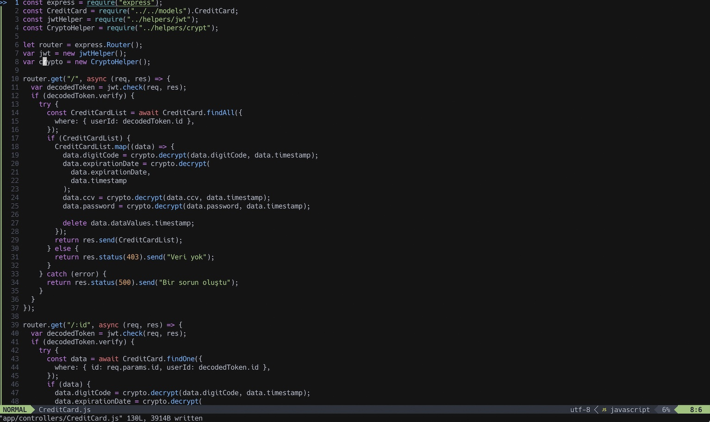
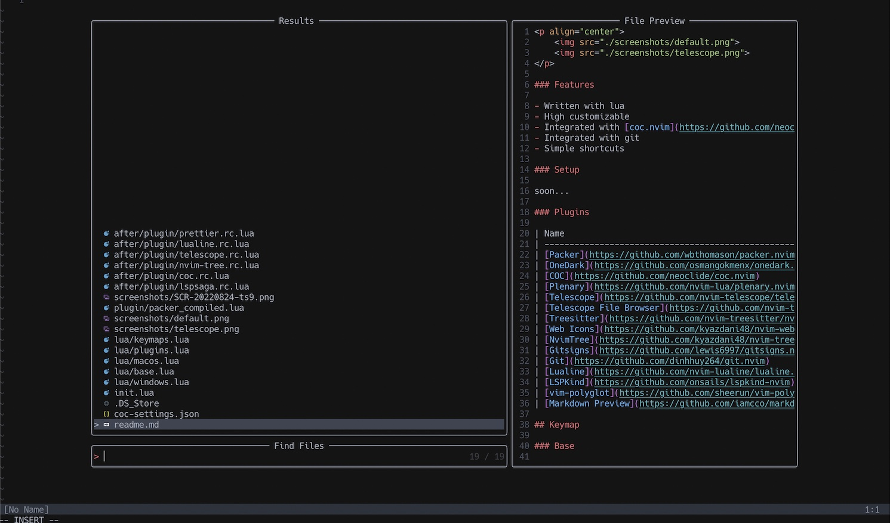

    
    

### Features

- Written with lua
- High customizable
- Integrated with [coc.nvim](https://github.com/neoclide/coc.nvim)
- Integrated with git
- Simple shortcuts

### Setup

soon...

### Plugins

| Name                                                                                    | Functionality                              |
| --------------------------------------------------------------------------------------- | ------------------------------------------ |
| [Packer](https://github.com/wbthomason/packer.nvim)                                     | Package management                         |
| [OneDark](https://github.com/osmangokmenx/onedark.vim)                                  | Onedark Theme                              |
| [COC](https://github.com/neoclide/coc.nvim)                                             | Highlight, code complation, snippets etc.  |
| [Plenary](https://github.com/nvim-lua/plenary.nvim)                                     | For telescope.nvim                         |
| [Telescope](https://github.com/nvim-telescope/telescope.nvim)                           | Finder (like fzf.vim)                      |
| [Telescope File Browser](https://github.com/nvim-telescope/telescope-file-browser.nvim) | Finder (like fzf.vim)                      |
| [Treesitter](https://github.com/nvim-treesitter/nvim-treesitter)                        | Highlight telescope and other stuffs       |
| [Web Icons](https://github.com/kyazdani48/nvim-web-devicons)                            | Icons                                      |
| [NvimTree](https://github.com/kyazdani48/nvim-tree.lua)                                 | NERDTree alternative                       |
| [Gitsigns](https://github.com/lewis6997/gitsigns.nvim)                                  | Git status and some other stuffs about git |
| [Git](https://github.com/dinhhuy264/git.nvim)                                           | Git stuffs                                 |
| [Lualine](https://github.com/nvim-lualine/lualine.nvim)                                 | airline alternative for lua                |
| [LSPKind](https://github.com/onsails/lspkind-nvim)                                      | vscode-like code pictograms                |
| [vim-polyglot](https://github.com/sheerun/vim-polyglot)                                 | Language support                           |
| [Markdown Preview](https://github.com/iamcco/markdown-preview.nvim)                     | Live markdown preview                      |

## Keymap

### Base

| Mapping        | Functionality               |
| -------------- | --------------------------- |
| `,`            | Leader key                  |
| `ctrl + a`     | Increment                   |
| `ctrl + x `    | Decrementkey                |
| `t + e`        | Tab Edit                    |
| `<leader> + ö` | Toggle NvimTree             |
| `esc + esc`    | Disable search highlighting |

### Telescope

| Mapping         | Functionality                    |
| --------------- | -------------------------------- |
| `<leader> + f ` | finder                           |
| `s + f`         | File explorer                    |
| `leader + rg `  | Find in all files in project dir |
| `t + e`         | Tab Edit                         |
| `<leader> + ö`  | Toggle NvimTree                  |
| `esc + esc`     | Disable search highlighting      |
| `;;`            | Resume searching                 |
| `;t`            | Help tags                        |

### coc

| Mapping         | Functionality                 |
| --------------- | ----------------------------- |
| `<leader> + jd` | Jump defination               |
| `<leader> + rn` | Rename                        |
| `<leader> + jt` | Jump type defination          |
| `<leader> + ji` | Jump impelmentation           |
| `<leader> + jr` | Jump references               |
| `<leader> + a`  | code action (like eslint fix) |

### Git

| Mapping        | Functionality     |
| -------------- | ----------------- |
| `<leader> + p` | Show line changes |
